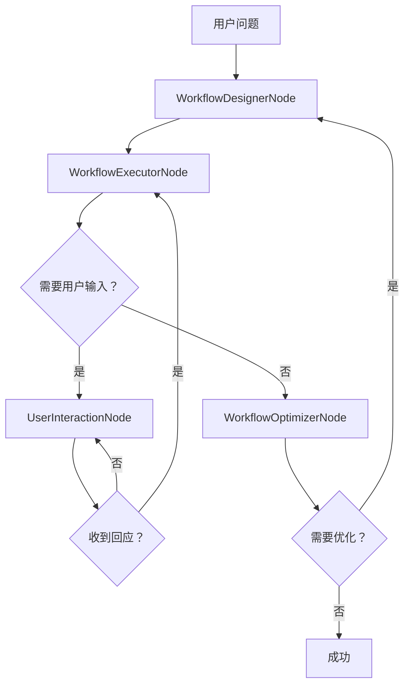

# PocketFlow 通用智能体系统

一个构建于 PocketFlow 之上的复杂智能体系统，能够动态设计并执行工作流来解决用户的复杂问题。该系统能够从成功的工作流中学习，并支持处理用户交互和敏感操作权限管理。

## 🎯 系统概览

通用智能体系统旨在通过以下方式解决复杂和模糊的问题：

1. **分析** 用户问题并设计合适的工作流
2. **动态执行** 工作流，调用可用节点
3. **学习** 成功的工作流模式并重用
4. **处理** 用户交互和敏感权限申请
5. **优化** 工作流流程，基于执行结果与用户反馈

## 🏗️ 系统架构

### 核心组件

#### 1. **节点注册器** (`utils/node_registry.py`)

* **作用**：记录所有智能体可用的节点
* **功能**：

  * 节点元数据（描述、输入、输出、权限等级）
  * 分类（搜索、分析、预订、支付等）
  * 权限等级（无、基础、敏感、关键）
  * 示例用法模式

#### 2. **工作流存储器** (`utils/workflow_store.py`)

* **作用**：持久化保存成功的工作流以供重用
* **功能**：

  * 工作流模式的持久化存储
  * 基于相似度的工作流检索
  * 成功率跟踪与学习机制
  * 提供工作流优化建议

#### 3. **权限管理器** (`utils/permission_manager.py`)

* **作用**：处理敏感操作所需的用户权限
* **功能**：

  * 创建并跟踪权限申请请求
  * 权限请求超时处理
  * 支持多种权限类型（支付、预订等）
  * 用户响应处理机制

#### 4. **智能体节点** (`nodes.py`)

##### WorkflowDesignerNode（工作流设计节点）

* 使用 LLM 分析用户问题
* 根据可用节点设计工作流
* 借鉴类似历史工作流
* 生成结构化工作流定义

##### WorkflowExecutorNode（工作流执行节点）

* 动态执行设计好的工作流
* 节点名映射为实际实现函数
* 处理进度反馈与异常管理
* 将成功工作流保存入存储器

##### UserInteractionNode（用户交互节点）

* 处理用户问题与回应
* 发送权限申请
* 收集用户输入

##### WorkflowOptimizerNode（工作流优化节点）

* 分析工作流结果中的问题
* 提出改进建议
* 集成用户反馈

### 工作流设计图示

系统采用高级流程设计以处理复杂场景：



## 🚀 快速开始

### 前置条件

1. **Python 3.8+**
2. **OpenAI API Key**（用于调用 LLM）
3. **Google Gemini API Key**（可选备用 LLM）

### 安装步骤

1. **克隆项目并进入目录：**

   ```bash
   cd backend
   ```

2. **安装依赖：**

   ```bash
   pip install -r requirements.txt
   ```

3. **设置环境变量：**

   ```bash
   export OPENAI_API_KEY="你的-openai-api-key"
   export GEMINI_API_KEY="你的-gemini-api-key"  # 可选
   ```

4. **运行服务：**

   ```bash
   python server.py
   ```

服务器将运行在 `http://localhost:8000`

### API 文档

运行后访问 `http://localhost:8000/docs` 查看交互式 API 文档。

## 📡 API 接口

### WebSocket 接口

#### `/api/v1/ws` - 通用智能体 WebSocket

处理实时交互：

**消息类型：**

* `chat`: 用户提问
* `user_response`: 用户对智能体提问的回应
* `permission_response`: 用户对权限请求的回应
* `feedback`: 用户反馈用于优化

**使用示例：**

```javascript
const ws = new WebSocket('ws://localhost:8000/api/v1/ws');

ws.send(JSON.stringify({
    type: 'chat',
    content: '帮我订一张洛杉矶飞往上海的高性价比机票，最好是下午出发的。'
}));

ws.onmessage = (event) => {
    const data = JSON.parse(event.data);
    console.log(data.type, data.content);
};
```

### REST API 接口

#### 节点注册

* `GET /api/v1/nodes` - 获取所有节点
* `GET /api/v1/nodes/{node_name}` - 获取指定节点
* `GET /api/v1/nodes/category/{category}` - 按类别获取节点

#### 工作流存储

* `GET /api/v1/workflows` - 获取所有工作流
* `GET /api/v1/workflows/{workflow_id}` - 获取指定工作流
* `GET /api/v1/workflows/similar?question={question}` - 查询相似工作流
* `DELETE /api/v1/workflows/{workflow_id}` - 删除工作流
* `GET /api/v1/workflows/stats` - 获取工作流统计信息

#### 权限管理

* `GET /api/v1/permissions` - 获取待处理权限请求
* `GET /api/v1/permissions/{request_id}` - 获取指定权限请求
* `POST /api/v1/permissions/{request_id}/respond` - 响应权限请求
* `GET /api/v1/permissions/stats` - 获取权限统计

## 🔧 使用示例

### 订票场景示例

请求示例：

> “帮我订一张从洛杉矶飞往上海的高性价比机票，最好下午出发。”

**执行流程：**

1. **WorkflowDesignerNode** 设计出如下工作流：

   ```yaml
   workflow:
     name: 订票工作流
     nodes:
       - name: flight_search
         description: 搜索航班选项
       - name: cost_analysis
         description: 成本分析与筛选性价比
       - name: result_summarizer
         description: 总结推荐结果
   ```

2. **WorkflowExecutorNode** 执行：

   * 模拟搜索航班
   * 分析费用与偏好
   * 输出推荐

3. **UserInteractionNode** 若需信息或权限则通知用户

4. **WorkflowOptimizerNode** 根据结果优化流程

5. **Workflow Store** 保存该工作流供下次使用

### 添加新节点

在 `utils/node_registry.py` 注册：

```python
node_registry.register_node(NodeMetadata(
    name="custom_node",
    description="该节点的功能描述",
    category=NodeCategory.ANALYSIS,
    permission_level=PermissionLevel.NONE,
    inputs=["input1", "input2"],
    outputs=["output1"],
    examples=[{"input1": "示例", "output1": "结果"}]
))
```

然后在 `WorkflowExecutorNode._execute_node()` 中实现逻辑。

## 🧠 学习与优化机制

### 工作流学习

* 成功的工作流会自动保存
* 相似问题可复用历史流程
* 系统记录成功率并用于排序

### 优化机制

* 失败工作流会触发分析与优化建议
* 用户反馈用于改进流程
* 系统可基于问题重构工作流

### 权限处理

* 敏感操作需显式权限
* 权限请求支持超时机制
* 不同操作有不同权限等级

## 🔒 安全与权限控制

### 权限等级

* **NONE**：无需权限
* **BASIC**：用户确认即可
* **SENSITIVE**：需要详细确认
* **CRITICAL**：需明确详细批准

### 敏感操作包括：

* 支付处理
* 预订确认
* 数据访问
* 系统变更操作

## 📊 统计与监控

系统提供完整的统计信息：

* **工作流存储**：成功率、使用次数、节点类别
* **权限管理**：允许/拒绝率、响应时间
* **节点注册器**：各类节点概览

## 🛠️ 开发说明

### 项目结构

```
backend/
├── agent/
│   ├── nodes.py              # 智能体节点实现
│   ├── flow.py               # 工作流逻辑
│   ├── utils/
│   │   ├── node_registry.py  # 节点注册器
│   │   ├── workflow_store.py # 工作流存储
│   │   ├── permission_manager.py # 权限管理
│   │   └── stream_llm.py     # LLM 工具
│   └── README.md
├── server.py                 # FastAPI 服务入口
├── requirements.txt          # 项目依赖
└── README.md                # 项目说明文档
```

### 扩展指南

1. **添加新节点**：注册节点并在执行器中实现
2. **新增工作流**：在 `flow.py` 中编写逻辑
3. **扩展工具包**：新增 utils 模块
4. **新增 API**：在 FastAPI 中添加新接口

### 测试方式

```bash
# 测试服务是否正常
curl http://localhost:8000/health

# 测试节点接口
curl http://localhost:8000/api/v1/nodes

# 测试工作流存储
curl http://localhost:8000/api/v1/workflows
```

## 🤝 贡献须知

1. 遵循 PocketFlow 的设计模式
2. 补充完整文档
3. 包含异常处理与日志记录
4. 结合多种用户场景进行测试
5. 更新节点注册器支持新功能

## 📝 许可协议

本项目遵循与 PocketFlow 相同的开源许可协议。

---

**注意**：本系统为演示版本，外部服务如订票、支付等为模拟实现。若用于生产环境，请接入真实 API 服务。
