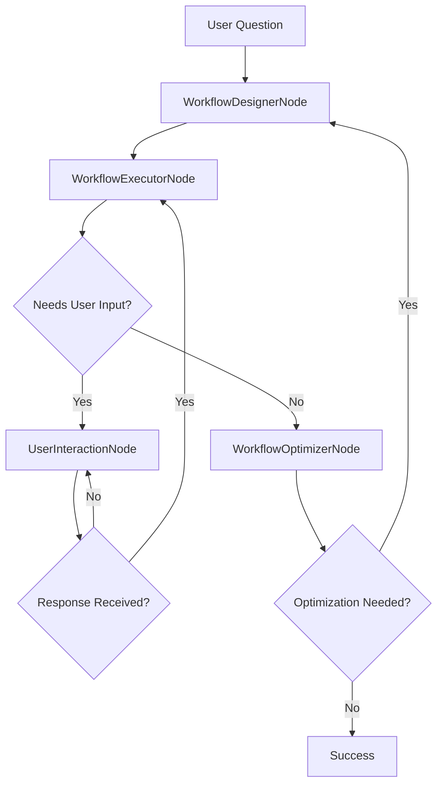

# PocketFlow General Agent System

A sophisticated agent system built on PocketFlow that dynamically designs and executes workflows to solve complex user problems. The system learns from successful workflows and handles user interactions with intelligent permission management for sensitive operations.

## 📋 Table of Contents

- [🎯 Overview](#-overview)
- [🏗️ System Architecture](#️-system-architecture)
- [🚀 Getting Started](#-getting-started)
- [📡 API Endpoints](#-api-endpoints)
- [🔧 Example Usage](#-example-usage)
- [🧠 Learning and Optimization](#-learning-and-optimization)
- [🔒 Security and Permissions](#-security-and-permissions)
- [📊 Monitoring and Statistics](#-monitoring-and-statistics)
- [🛠️ Development](#️-development)
- [Logging System](#logging-system)
- [Configuration](#configuration)
- [Extension Guidelines](#extension-guidelines)
- [Troubleshooting](#troubleshooting)
- [🤝 Contributing](#-contributing)
- [📝 License](#-license)
- [🔗 Related Documentation](#-related-documentation)

## 🎯 Overview

The General Agent System is designed to solve complex, vague questions by:

1. **Analyzing** user questions and designing appropriate workflows
2. **Executing** workflows dynamically using available nodes
3. **Learning** from successful workflows and reusing patterns
4. **Handling** user interactions and permissions for sensitive operations
5. **Optimizing** workflows based on results and user feedback

## 🏗️ System Architecture

### Core Components

#### 1. **Node Registry** ([`utils/node_registry.py`](agent/utils/node_registry.py))
- **Purpose**: Catalogs all available nodes that the agent can use
- **Features**:
  - Node metadata (description, inputs, outputs, permission levels)
  - Categorization (search, analysis, booking, payment, etc.)
  - Permission levels (none, basic, sensitive, critical)
  - Example usage patterns

#### 2. **Workflow Store** ([`utils/workflow_store.py`](agent/utils/workflow_store.py))
- **Purpose**: Stores and retrieves successful workflows for reuse
- **Features**:
  - Persistent storage of workflow patterns
  - Similarity-based workflow retrieval
  - Success rate tracking and learning
  - Workflow optimization suggestions

#### 3. **Permission Manager** ([`utils/permission_manager.py`](agent/utils/permission_manager.py))
- **Purpose**: Handles user permissions for sensitive operations
- **Features**:
  - Permission request creation and tracking
  - Timeout management for permission requests
  - Support for different permission types (payment, booking, etc.)
  - User response handling

#### 4. **Agent Nodes** ([`nodes.py`](agent/nodes.py))

##### WorkflowDesignerNode
- Analyzes user questions using LLM
- Designs workflows based on available nodes
- Considers similar past workflows
- Generates structured workflow definitions

##### WorkflowExecutorNode
- Executes designed workflows dynamically
- Maps node names to actual implementations
- Handles progress reporting and error handling
- Saves successful workflows to store

##### UserInteractionNode
- Manages user questions and responses
- Handles permission requests
- Coordinates user input collection

##### WorkflowOptimizerNode
- Analyzes workflow results for issues
- Suggests workflow improvements
- Handles user feedback integration

### Flow Design

The system uses a sophisticated flow that can handle complex scenarios:



## 🚀 Getting Started

### Prerequisites

1. **Python 3.8+**
2. **OpenAI API Key** (for LLM calls)
3. **Google Generative AI Key** (optional, for alternative LLM)
4. **Firecrawl API Key** (for web scraping)
You can get your API key from https://www.firecrawl.dev/.

You can set your API key in the `.env` file. And run `python3 setup_env.py` to generate the `.env_activate.sh` and `.env_deactivate.sh` files. Using `.env_activate.sh` to activate the environment variables without overwriting the existing environment variables. And using `.env_deactivate.sh` to deactivate the environment variables and restore the original environment variables.

### Installation

1. **Clone and navigate to backend:**
   ```bash
   cd backend
   ```

2. **Install dependencies:**
   ```bash
   pip install -r requirements.txt
   ```

3. **Set environment variables:**
   ```bash
   export OPENAI_API_KEY="your-openai-api-key"
   export GEMINI_API_KEY="your-gemini-api-key"  # optional
   ```

4. **Run the server:**
   ```bash
   python server.py
   ```

The server will start on `http://localhost:8000`

### API Documentation

Once running, visit `http://localhost:8000/docs` for interactive API documentation.

## 📡 API Endpoints

### WebSocket Endpoints

#### `/api/v1/ws` - General Agent WebSocket
Handles real-time agent interactions:

**Message Types:**
- `chat`: Standard user question
- `user_response`: Response to agent questions
- `permission_response`: Response to permission requests
- `feedback`: User feedback for optimization

**Example Usage:**
```javascript
const ws = new WebSocket('ws://localhost:8000/api/v1/ws');

// Send a question
ws.send(JSON.stringify({
    type: 'chat',
    content: 'Help book a flight ticket from Los Angeles to Shanghai with high cost performance, preferably departing in the afternoon.'
}));

// Handle responses
ws.onmessage = (event) => {
    const data = JSON.parse(event.data);
    console.log(data.type, data.content);
};
```

### REST API Endpoints

#### Node Registry
- `GET /api/v1/nodes` - Get all available nodes
- `GET /api/v1/nodes/{node_name}` - Get specific node
- `GET /api/v1/nodes/category/{category}` - Get nodes by category

#### Workflow Store
- `GET /api/v1/workflows` - Get all stored workflows
- `GET /api/v1/workflows/{workflow_id}` - Get specific workflow
- `GET /api/v1/workflows/similar?question={question}` - Find similar workflows
- `DELETE /api/v1/workflows/{workflow_id}` - Delete workflow
- `GET /api/v1/workflows/stats` - Get workflow statistics

#### Permission Management
- `GET /api/v1/permissions` - Get pending permissions
- `GET /api/v1/permissions/{request_id}` - Get specific permission
- `POST /api/v1/permissions/{request_id}/respond` - Respond to permission
- `GET /api/v1/permissions/stats` - Get permission statistics

## 🔧 Example Usage

### Flight Booking Example

The system can handle complex requests like:

> "Help book a flight ticket from Los Angeles to Shanghai with high cost performance, preferably departing in the afternoon."

**What happens:**

1. **WorkflowDesignerNode** analyzes the question and designs a workflow:
   ```yaml
   workflow:
     name: Flight Booking Workflow
     nodes:
       - name: flight_search
         description: Search for flight options
       - name: cost_analysis
         description: Analyze costs and find best value
       - name: result_summarizer
         description: Present recommendations
   ```

2. **WorkflowExecutorNode** executes the workflow:
   - Searches for flights (mock implementation)
   - Analyzes costs and preferences
   - Generates recommendations

3. **UserInteractionNode** handles any user questions or permissions

4. **WorkflowOptimizerNode** evaluates success and suggests improvements

5. **Workflow Store** saves the successful workflow for future reuse

### Adding New Nodes

To add new functionality, register nodes in [`utils/node_registry.py`](agent/utils/node_registry.py):

```python
node_registry.register_node(NodeMetadata(
    name="custom_node",
    description="Description of what this node does",
    category=NodeCategory.ANALYSIS,
    permission_level=PermissionLevel.NONE,
    inputs=["input1", "input2"],
    outputs=["output1"],
    examples=[{"input1": "example", "output1": "result"}]
))
```

Then implement the node logic in `WorkflowExecutorNode._execute_node()` in [`nodes.py`](agent/nodes.py).

## 🧠 Learning and Optimization

### Workflow Learning
- Successful workflows are automatically saved
- Similar questions can reuse past workflow patterns
- Success rates are tracked and used for ranking

### Optimization
- Failed workflows trigger optimization analysis
- User feedback is incorporated into workflow improvements
- The system can redesign workflows based on issues

### Permission Handling
- Sensitive operations require explicit user permission
- Permission requests have timeouts
- Different permission levels for different operations

## 🔒 Security and Permissions

### Permission Levels
- **NONE**: No permission required
- **BASIC**: Simple confirmation
- **SENSITIVE**: Detailed review required
- **CRITICAL**: Explicit approval with details

### Sensitive Operations
- Payment processing
- Booking confirmations
- Data access
- System actions

## 📊 Monitoring and Statistics

The system provides comprehensive statistics:

- **Workflow Store**: Success rates, usage counts, node categories
- **Permission Manager**: Grant/deny rates, response times
- **Node Registry**: Available nodes by category

## 🛠️ Development

### Project Structure
```
backend/
├── agent/
│   ├── nodes.py              # Agent node implementations
│   ├── flow.py               # Flow definitions
│   ├── utils/
│   │   ├── node_registry.py  # Node catalog
│   │   ├── workflow_store.py # Workflow persistence
│   │   ├── permission_manager.py # Permission handling
│   │   └── stream_llm.py     # LLM utilities
│   └── README.md
├── server.py                 # FastAPI server
├── requirements.txt          # Dependencies
└── README.md                 # This file
```

### Extending the System

1. **Add New Nodes**: Register in node registry and implement in executor
2. **Add New Flows**: Create new flow functions in [`flow.py`](agent/flow.py)
3. **Add New Utilities**: Extend the utils package
4. **Add New Endpoints**: Extend the FastAPI server

## 🧪 Testing

### Unit Tests

The system includes comprehensive unit tests for all function nodes:

```bash
# Run all function node tests
pytest agent/test/test_function_nodes.py

# Run with verbose output
pytest agent/test/test_function_nodes.py -v
```

### Test Coverage

The test suite covers all function nodes:
- `FirecrawlScrapeNode` - Web scraping functionality
- `FlightBookingNode` - Flight booking simulation
- `PreferenceMatcherNode` - User preference matching
- `DataFormatterNode` - Data formatting utilities
- `PermissionRequestNode` - Permission handling
- `UserQueryNode` - User interaction management
- `ResultSummarizerNode` - Result summarization
- `CostAnalysisNode` - Cost analysis logic

### Test Features

- **Mocked Dependencies**: External APIs and LLM calls are mocked for reliable testing
- **Comprehensive Coverage**: Each node's `prep`, `exec`, and `post` methods are tested
- **Error Handling**: Tests include error scenarios and edge cases
- **Shared Store Validation**: Tests verify correct data storage in shared store

## Logging System

The system includes a comprehensive logging system to track execution flow and debug issues.

### Logging Levels

- **DEBUG**: Detailed logging for development (includes function names and line numbers)
- **INFO**: Standard logging for production (recommended for most use cases)
- **WARNING**: Only warnings and errors
- **ERROR**: Only error messages
- **QUIET**: Only critical errors (for performance)

### Usage

```bash
# Set logging level via environment variable
export LOG_LEVEL=DEBUG
python server.py

# Or set it in code
from logging_config import setup_logging
setup_logging('DEBUG')

# Test different logging levels
python test_logging.py
```

### Logging Features

- **Emoji-based Logging**: Easy to identify different types of operations
- **Structured Messages**: Clear, consistent log format
- **Node-specific Logging**: Each node logs its operations separately
- **Flow Tracking**: Track the entire workflow execution process
- **Error Handling**: Comprehensive error logging with context
- **Performance Monitoring**: Track execution times and resource usage

### Example Log Output

```log
2024-01-15 10:30:15 - agent.nodes - INFO - 🔄 WorkflowDesignerNode: Starting prep_async
2024-01-15 10:30:15 - agent.nodes - INFO - 📝 WorkflowDesignerNode: Processing question: Help book a flight ticket from Los Angeles...
2024-01-15 10:30:15 - agent.nodes - INFO - 🔧 WorkflowDesignerNode: Found 11 available nodes
2024-01-15 10:30:15 - agent.nodes - INFO - 🤖 WorkflowDesignerNode: Calling LLM to design workflow
2024-01-15 10:30:18 - agent.nodes - INFO - ✅ WorkflowDesignerNode: Successfully parsed YAML response
2024-01-15 10:30:18 - agent.nodes - INFO - 🎯 WorkflowDesignerNode: Designed workflow 'Flight Booking Workflow' with 6 steps
```

## Configuration

### Environment Variables

- `OPENAI_API_KEY`: Your OpenAI API key
- `LOG_LEVEL`: Logging level (DEBUG, INFO, WARNING, ERROR, QUIET)
- `LOG_FILE`: Optional log file path

### Logging Configuration

The logging system can be configured in several ways:

1. **Environment Variables**:
   ```bash
   export LOG_LEVEL=DEBUG
   export LOG_FILE=logs/agent.log
   ```

2. **Code Configuration**:
   ```python
   from logging_config import setup_logging
   
   # Setup different logging levels
   setup_logging('DEBUG')      # Detailed logging
   setup_logging('INFO')       # Standard logging
   setup_logging('QUIET')      # Minimal logging
   ```

3. **File Logging**:
   ```python
   setup_logging('INFO', 'logs/agent.log')
   ```

## Extension Guidelines

### Adding New Nodes

1. Create a new node class in [`agent/nodes.py`](agent/nodes.py)
2. Implement the required async methods (`prep_async`, `exec_async`, `post_async`)
3. Add logging statements for debugging
4. Register the node in [`agent/utils/node_registry.py`](agent/utils/node_registry.py)

### Adding New Workflows

1. Design the workflow structure
2. Create node implementations if needed
3. Update the workflow store to save/retrieve workflows
4. Test with the demo or web interface

### Customizing Logging

1. Modify [`logging_config.py`](logging_config.py) for custom formatting
2. Add new loggers for specific components
3. Configure different log levels for different environments

## Troubleshooting

### Common Issues

1. **Import Errors**: Ensure all dependencies are installed
2. **API Key Issues**: Verify your OpenAI API key is set correctly
3. **WebSocket Connection**: Check if the server is running on the correct port
4. **Logging Issues**: Verify the LOG_LEVEL environment variable is set correctly

### Debug Mode

For detailed debugging, run with DEBUG logging:

```bash
LOG_LEVEL=DEBUG python server.py
```

This will show detailed information about:
- Node execution flow
- LLM calls and responses
- WebSocket communication
- Error details and stack traces

### Testing

```bash
# Test the server
curl http://localhost:8000/health

# Test node registry
curl http://localhost:8000/api/v1/nodes

# Test workflow store
curl http://localhost:8000/api/v1/workflows
```

## 🤝 Contributing

1. Follow the PocketFlow design patterns
2. Add comprehensive documentation
3. Include error handling and logging
4. Test with various user scenarios
5. Update the node registry for new functionality

## 📝 License

This project follows the same license as PocketFlow.

## 🔗 Related Documentation

- [Main Project README](../README.md) - Overview of the entire ObiAgent project
- [Agent Documentation](agent/README.md) - Detailed agent implementation docs
- [Requirements](requirements.txt) - Python dependencies
- [Server Implementation](server.py) - FastAPI server code

---

**Note**: This is a demonstration system with mock implementations for external services. In production, you would integrate with real APIs for flight search, payment processing, etc.